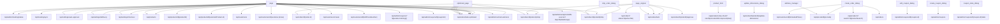

# 🔗 Dependency Graph

```mermaid
graph TD
    page --> _api_admin_tracking_status["/api/admin/tracking/status"]
    page --> _api_admin_tracking_status["/api/admin/tracking/status"]
    page --> _api_tracking_sync["/api/tracking/sync"]
    page --> _api_settings_auto_approval["/api/settings/auto-approval"]
    page --> _api_settings_auto_approval["/api/settings/auto-approval"]
    page --> _api_settings_delhivery["/api/settings/delhivery"]
    page --> _api_settings_delhivery["/api/settings/delhivery"]
    page --> _api_settings_checkout["/api/settings/checkout"]
    page --> _api_settings_checkout["/api/settings/checkout"]
    product_form --> _api_products_sku_check_sku___encodeURIComponent_sku__["/api/products/sku-check?sku=${encodeURIComponent(sku)}"]
    page --> _api_products["/api/products"]
    page --> _api_products["/api/products"]
    page --> _api_products___productId_["/api/products/${productId}"]
    page --> _api_products___selectedProduct_id_["/api/products/${selectedProduct.id}"]
    update_dimensions_dialog --> _api_orders___orderId__update_dimensions["/api/orders/${orderId}/update-dimensions"]
    ship_order_dialog --> _api_orders___orderId__ship["/api/orders/${orderId}/ship"]
    page --> _api_orders___orderId__ship["/api/orders/${orderId}/ship"]
    page_original --> _api_orders___orderId__ship["/api/orders/${orderId}/ship"]
    optimized_page --> _api_orders___orderId__ship["/api/orders/${orderId}/ship"]
    page --> _api_orders___order_id_["/api/orders/${order.id}"]
    optimized_page --> _api_orders___order_id_["/api/orders/${order.id}"]
    page --> _api_orders___order_id__ship["/api/orders/${order.id}/ship"]
    page_original --> _api_orders___order_id__ship["/api/orders/${order.id}/ship"]
    optimized_page --> _api_orders___order_id__ship["/api/orders/${order.id}/ship"]
    page --> _api_orders_bulk_optimized["/api/orders/bulk-optimized"]
    page --> _api_orders_bulk_optimized["/api/orders/bulk-optimized"]
    page --> _api_orders_bulk_optimized["/api/orders/bulk-optimized"]
    page --> _api_orders_bulk_optimized["/api/orders/bulk-optimized"]
    optimized_page --> _api_orders_bulk_optimized["/api/orders/bulk-optimized"]
    optimized_page --> _api_orders_bulk_optimized["/api/orders/bulk-optimized"]
    optimized_page --> _api_orders_bulk_optimized["/api/orders/bulk-optimized"]
    optimized_page --> _api_orders_bulk_optimized["/api/orders/bulk-optimized"]
    page_original --> _api_orders_status___activeTab_["/api/orders?status=${activeTab}"]
    page_original --> _api_orders_bulk["/api/orders/bulk"]
    page_original --> _api_orders_bulk["/api/orders/bulk"]
    page_original --> _api_orders_bulk["/api/orders/bulk"]
    page_original --> _api_orders___orderId__approve["/api/orders/${orderId}/approve"]
    create_order_dialog --> _api_pincode___pincode_["/api/pincode/${pincode}"]
    address_manager --> _api_pincode___pincode_["/api/pincode/${pincode}"]
    create_order_dialog --> _api_customers___formattedPhone_["/api/customers/${formattedPhone}"]
    create_order_dialog --> _api_products_search___productSearch_["/api/products?search=${productSearch}"]
    create_order_dialog --> _api_orders["/api/orders"]
    page --> _api_customers["/api/customers"]
    page --> _api_customers___customer_phone_["/api/customers/${customer.phone}"]
    page --> _api_customers_create["/api/customers/create"]
    page --> _api_customers___fullPhoneNumber_["/api/customers/${fullPhoneNumber}"]
    page --> _api_admin_coupons___params_toString___["/api/admin/coupons?${params.toString()}"]
    page --> _api_admin_coupons___couponId_["/api/admin/coupons/${couponId}"]
    edit_coupon_dialog --> _api_admin_coupons___coupon_id_["/api/admin/coupons/${coupon.id}"]
    create_coupon_dialog --> _api_admin_coupons["/api/admin/coupons"]
    coupon_stats_dialog --> _api_admin_coupons___coupon_id__stats["/api/admin/coupons/${coupon.id}/stats"]
    page --> _api_admin_cache_customers["/api/admin/cache/customers"]
    page --> _api_admin_cache_customers["/api/admin/cache/customers"]
    page --> _api_admin_analytics_traffic_sources_days___dateRange_["/api/admin/analytics/traffic-sources?days=${dateRange}"]
```
